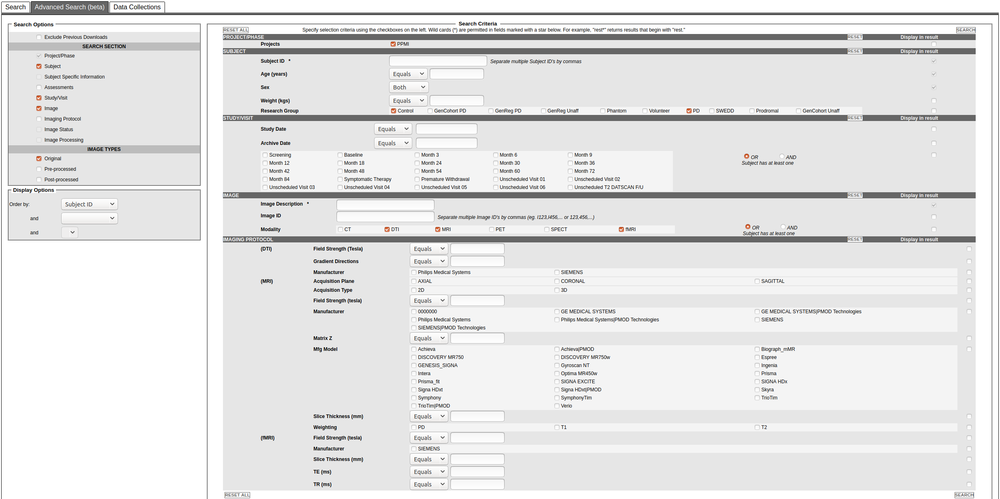
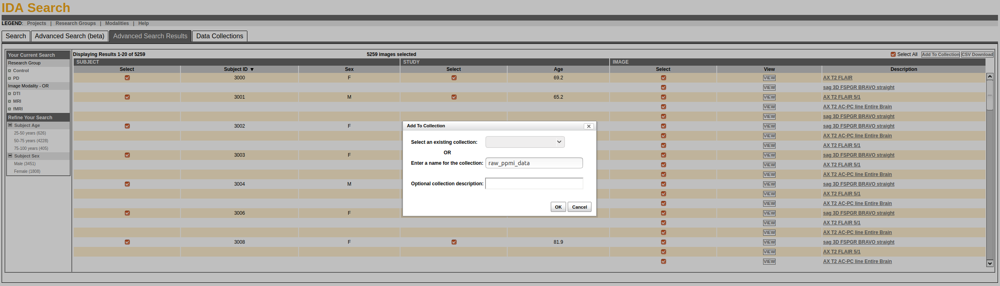

# Downloading data from the PPMI

## Getting access to the data

All of the analyses in this repository depend on data provided by the Parkinson's Progression Markers Initiative (PPMI).
While the data are freely available they are not wholly de-identified (for example, the subject-level MRI scans are not de-faced), and thus researchers are required to sign a Data Usage Agreement before they can use them.
You can register to apply for data access on the [PPMI website](https://www.ppmi-info.org).

1. Navigate to the [PPMI Data Access page](https://www.ppmi-info.org/access-data-specimens/download-data/).
You can reach the page from the main website by clicking "Access Data and Specimens" > "Download Data" in the top navigation bar.
1. On the data access page, select "Apply for Data Access" and follow the instructions (including signing the Data Usage Agreement and providing some basic information about yourself).
1. Once you've received an e-mail confirming your access with a username and password you should be good to go!

## Downloading the neuroimaging data

Unfortunately we cannot download the neuroimaging data programatically, so doing this step will require a bit more manual intervention than the rest of the workflows.

1. Navigate back to the [PPMI Data Access page](https://www.ppmi-info.org/access-data-specimens/download-data/) and sign in with the username and password provided to you by the PPMI.
1. Select "Download" > "Image Collections" in the top navigation bar and then click "Advanced Search (beta)" in the web app that loads.
1. Fill out the search options as below and then scroll down and click "Search":

1. On the resulting page, you will need to check the "Select All" box in the top right, and then "Add to Collection."
Fill out the box that pops up as below (or provide a new collection name) and click "OK":

1. Upon clicking "OK" you will be automatically re-directed to the newly create collection, which you need to download!
We want to download _everything_, so check the "All" box in the top right corner of the collection, and then choose either "1-Click Download" or "Advanced Download" and follow the instructions.
Make sure that you have selected the "As Archived" button next to the downloads so that we get the DICOM images!
This will be required for the [next step](./02_converting_to_BIDS.md), and having to re-download all the data because you grabbed the wrong format would be frustrating.
1. Unzip the downloaded data into the `data/raw/ppmi/dicoms` directory.

## Downloading the rest of the data

The remainder of the PPMI data can be programmatically downloaded, so you shouldn't need to do anything else on the PPMI website!
However, in order for this to work the commands we'll call need to know the username and password that you were provided with to access the PPMI database.
These commands will try to automatically detect your PPMI log-in information via the environmental variables `$PPMI_USER` and `$PPMI_PASSWORD`.
You can expose these variables by running the following two commands:

```bash
export PPMI_USER=your_username
export PPMI_PASSWORD=your_password
```

making sure to replace `your_username` and `your_password` with your PPMI username and password.

**NOTE**: Because the PPMI does not archive older versions of the clinical/behavioral data they upload to their server, it is possible that "newer" versions of this data downloaded from the PPMI may yield different results than those reported in the associated manuscript.
If you would like a copy of the EXACT behavioral files that were used to generate those analyses, please provide proof that you have signed the PPMI DUA to the [lead author](mailto:ross.markello@mail.mcgill.ca) and he will send you the relevant files.

---

## Next steps

You now have a choice: you can continue with the walkthrough (click the link at the bottom of this file) if you want to re-process all the neuroimaging data from scratch, or you can jump ahead and just re-run the final analyses using the data we provide with this repository.
The choice is yours!

[Click here to continue the walkthrough](./02_converting_to_BIDS.md)

[Click here to jump ahead](./04_snf_analyses.md)
